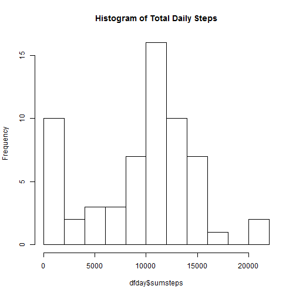
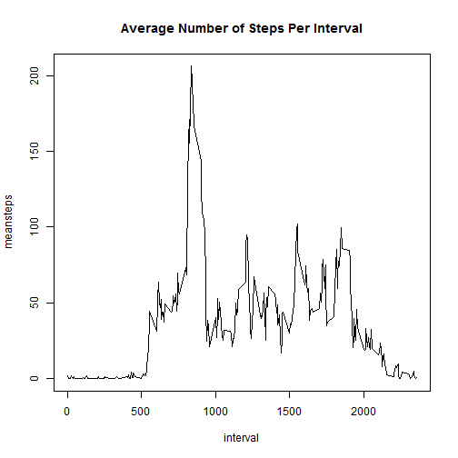
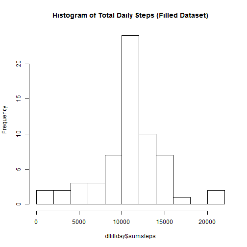
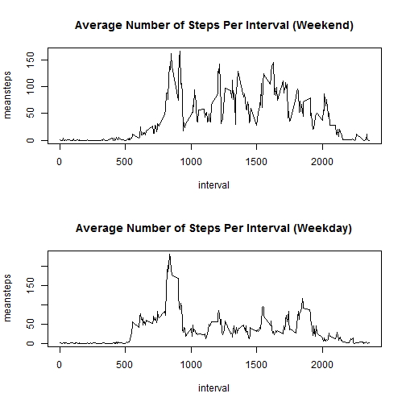

## Loading and preprocessing the data

```r
library("plyr")  
```

```
## Warning: package 'plyr' was built under R version 3.1.2
```

```r
df <- read.csv("activity.csv")
```

## What is mean total number of steps taken per day?


```r
dfday <- ddply(df,~date,summarise,sumsteps=sum(steps,na.rm=TRUE)) 
hist(dfday$sumsteps,breaks=10,main="Histogram of Total Daily Steps")  
```

 

```r
MeanStepsPerDay <- mean(dfday$sumsteps,na.rm = TRUE)
MedianStepsPerDay <- median(dfday$sumsteps,na.rm = TRUE)
```

The mean number of steps taken per day is 9354.2295082.

The median number of steps taken per day is 10395.

## What is the average daily activity pattern?

```r
dfint <- ddply(df,~interval,summarise,meansteps=mean(steps,na.rm=TRUE))
plot(dfint,type="l", main="Average Number of Steps Per Interval")
```

 

```r
maxinterval <- match(max(dfint$meansteps),dfint$meansteps)
maxintervalhour <- maxinterval/12
```

The 5-minute time interval with the most average steps across all recorded days is time interval 104. This interval is hour number 8.6666667.

## Imputing missing values
There were many instances of missing values in the data set. We'd like to observe the effect of filling these missing values in. The strategy used was to use the average for the specific interval for any missing values on different dates for that specific interval.

```r
totalNAs <- sum(is.na(df$steps))

impute.mean <- function(x) replace(x, is.na(x), mean(x, na.rm=TRUE))
dffill <- ddply(df, ~ interval, transform, steps = impute.mean(steps))
dffill <- dffill[order(dffill$date),]

dffillday <- ddply(dffill,~date,summarise,sumsteps=sum(steps,na.rm=TRUE))  
hist(dffillday$sumsteps,breaks=10,main="Histogram of Total Daily Steps (Filled Dataset)")
```

 

```r
MeanStepsPerDayFill <- mean(dffillday$sumsteps,na.rm = TRUE)
MedianStepsPerDayFill <- median(dffillday$sumsteps,na.rm = TRUE)
```
The NA values have been replaced with the average number of steps for that specific interval. The alternative was to replace NA's with the average for the entire day, but since there were days entirely made up of NA values, this would not provide meaningful replacements for many NA values.

Replacing the NA values in this fashion results in a mean steps per day of 1.0766189 &times; 10<sup>4</sup>. Before imputation, this was 9354.2295082. Similarly the new result for median steps per day is 1.0766189 &times; 10<sup>4</sup>. Before imputation, this was 10395. Inputting the missing data has raised the estimates for the total daily number of steps.

## Are there differences in activity patterns between weekdays and weekends?
Yes! There are clearly differences in the activity levels between weekends and weekdays.

```r
dffill2 <- cbind(dffill,c("Weekend", "Weekday", "Weekday", "Weekday", "Weekday", "Weekday", "Weekend")[as.POSIXlt(df$date)$wday + 1])
names(dffill2)[4] <- "daystatus"

par(mfrow = c(2,1))

dffill2weekend <- dffill2[dffill2$daystatus=="Weekend",]
dffill2weekday <- dffill2[dffill2$daystatus=="Weekday",]

dfintweekend <- ddply(dffill2weekend,~interval,summarise,meansteps=mean(steps,na.rm=TRUE))
dfintweekday <- ddply(dffill2weekday,~interval,summarise,meansteps=mean(steps,na.rm=TRUE))

plot(dfintweekend,type="l", main="Average Number of Steps Per Interval (Weekend)")
plot(dfintweekday,type="l", main="Average Number of Steps Per Interval (Weekday)")
```

 
